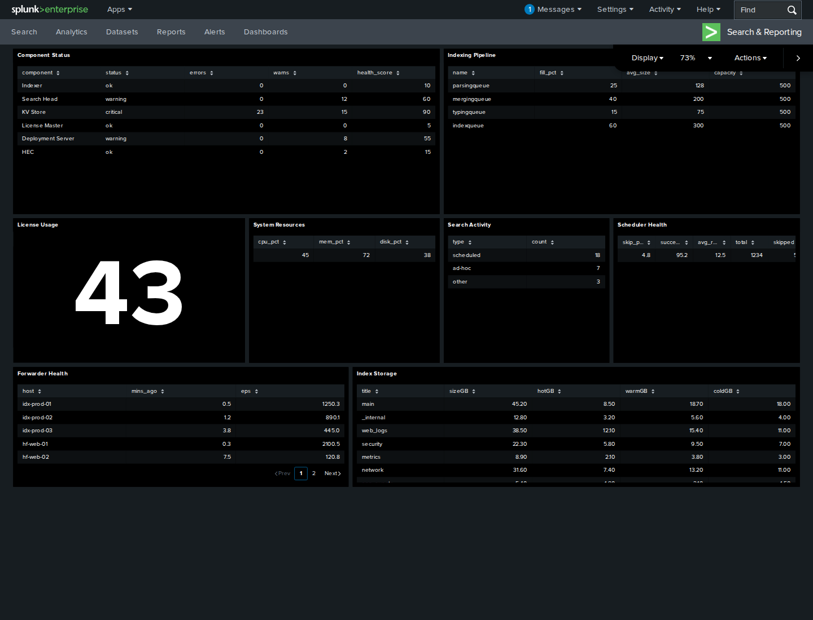

# splunk-dashboard-studio-python

Build and validate deterministic Splunk Enterprise Dashboard Studio definitions with Python 3.12+
and Pydantic 2.

```python
from splunk_dashboard_studio import DashboardBuilder, canonical_json

builder = DashboardBuilder(title="Service health", target="9.4.3")
search = builder.add_search(
    "index=otel_traces service.name=checkout | stats perc95(duration_ms) AS p95_ms",
    name="latency",
)
builder.add_visualization(
    "splunk.singlevalue",
    name="p95 latency",
    data_sources={"primary": search},
    title="p95 latency",
)

print(canonical_json(builder.build(), indent=2))
```

Version 0.2.1 is an unreleased release candidate. The package is intentionally Splunk
Enterprise-only. It does not claim Splunk Cloud compatibility, connect to a deployment, create
saved searches, publish dashboards, or install Node at runtime.

## Included in v0.2.1

- Exact target profiles for the actively supported 9.4, 10.0, 10.2, and 10.4 release lines.
- Deterministic builders for searches, saved-search references, chains, defaults, tokens, inputs,
  visualizations, tabbed absolute layouts, application properties, and expressions.
- Native validation for references, feature boundaries, SPL1 structure, Dynamic Options Syntax,
  canvas bounds, and search-chain depth, fan-out, cycles, and inherited options.
- A typed `portable-observability-v1` telemetry contract, per-panel provenance, saved-search
  proposals, evidence manifests, and an eight-skill agent taxonomy.
- Ten packaged observability dashboards with checked definitions and manifests.
- An offline codec for documented `data/ui/views` XML, including safe CDATA encoding, normalized
  SHA-256 comparison, and deterministic JSON-pointer diffs.
- An integration-only Splunk Free and Playwright harness for exact search math, live REST
  publish/readback, browser rendering, screenshot regression, and advisory vision QA.
- Locked Splunk-owned NPM validation engines in CI without redistributing them in Python artifacts.

## Development install

```console
uv sync --all-groups
uv run pytest -q
```

The native compatibility matrix covers Python 3.12, 3.13, and 3.14. Pydantic's compiled
`pydantic-core` handles model parsing and serialization.

## Catalog

List the included dashboards and their telemetry requirements:

```console
uv run splunk-studio catalog list
```

Build a canonical definition or a definition-plus-evidence bundle:

```console
uv run splunk-studio catalog build kubernetes_workload_health \
  --target 9.4.3 --output dashboard.json

uv run splunk-studio catalog build business_journey_slo \
  --target 10.2.0 --artifact bundle --output bundle.json
```

The catalog uses logical indexes such as `otel_metrics`, `otel_logs`, `otel_traces`, and
`platform_events`. Deployers map those names and the documented semantic fields to local data.
The package deliberately ships no sample telemetry or hidden index assumptions.

See [the example catalog](docs/example-catalog.md) and the checked files under
[`examples/catalog/`](examples/catalog/).

## Source-derived templates

The portable catalog is complemented by a provenance-locked source-template lane. The first entry
imports the actual Splunk Health Dashboard Studio definition and eight Canvas visualization
contracts from
[`rcastley/splunk-custom-visualizations`](https://github.com/rcastley/splunk-custom-visualizations)
at an exact Apache-2.0 revision:

```console
uv run splunk-studio template list
uv run splunk-studio template build rcastley_splunk_health --target 10.2.0
uv run splunk-studio template build rcastley_splunk_health_portable --target 9.4.3
```

The source-faithful template requires Splunk Enterprise 10.2+ and the matching `splunk_health`
app. Its distinct portable port keeps the searches and layout but uses only built-in tables and a
single value, so it renders on Splunk Enterprise 9.4+ without the app. The Python distribution
ships both definitions and attribution, not the custom app or its JavaScript. See
[source-derived templates](docs/source-templates.md) for provenance, synchronization, and live-test
behavior.

## Render samples

The [dashboard gallery](docs/gallery.md) contains five 1440 by 1100 captures copied exactly from
reviewed live Splunk baselines, including the portable Splunk Health dashboard on Enterprise 9.4.3
and the app-qualified source dashboard on 10.4.0.

[](docs/gallery.md)

## CLI

```console
# Validate a definition for an exact Enterprise target.
uv run splunk-studio validate dashboard.json --target 10.2.0

# Read a definition from standard input.
uv run splunk-studio validate - --target 9.4.3 < dashboard.json

# Emit one schema or the complete machine-facing schema bundle.
uv run splunk-studio schema agent > agent-schema.json
uv run splunk-studio schema bundle > schema-bundle.json

# Generate the native and official-engine compatibility corpus.
uv run splunk-studio corpus --target 10.4.0 --output corpus.jsonl

# Propose safe base/chain consolidation without rewriting SPL.
uv run splunk-studio optimize dashboard.json
```

Commands emit machine-readable JSON or JSONL. Exit code `0` means success, `1` means a completed
validation found an invalid dashboard, and `2` means an invocation, target, input, or system error.

## Offline view codec

```python
from splunk_dashboard_studio import StudioView, compare_roundtrip, encode_view_xml

view = StudioView(label="Service health", definition=builder.build(), theme="dark")
xml = encode_view_xml(view)
comparison = compare_roundtrip(view, xml)
assert comparison.equivalent
```

The codec implements the documented storage envelope only and performs no HTTP requests. The
separate disposable integration harness exercises that envelope against live Splunk; the runtime
package remains offline serialization and drift-analysis tooling, not deployment automation.

## Live render regression

The integration harness uses a pinned official Splunk Enterprise standalone in Free mode and a
locked Playwright/Chromium environment. It validates untouched catalog SPL against empty typed
indexes, exact synthetic render math, REST publish/readback, panel visibility, browser failures,
and target-specific screenshots. It also emits a QA overview and provider-neutral vision report
contract.

Invoking the harness starts the official image and automatically passes Splunk's `--accept-license`
flag; targets that require it also receive `--accept-sgt-current-at-splunk-com`. Run it only after
reviewing the linked Splunk terms. Authentication and ACL behavior are intentionally not test
objectives.

See [live visual regression](docs/visual-regression.md) before running the official image. The
repository includes reviewed full-suite baselines generated from every pinned target; normal local
and CI runs compare against them without rewriting snapshots. Candidate regeneration remains a
manual, review-before-commit operation.

## Validation authority

The native validator and official CI engines have different jobs:

- Python owns product-version policy and cross-object semantics.
- Locked Splunk NPM schemas own exact Splunk option shapes and the official DOS parser.
- Release evidence is valid only when every required lane agrees with its declared expectation.

Node remains integration/CI-only. Build inspection rejects the entire integration harness,
JavaScript/TypeScript, NPM manifests, browser outputs, and `node_modules` from both wheel and
source-distribution artifacts. See [architecture](docs/architecture.md) and [compatibility
policy](docs/compatibility.md).

## Security and status

Dashboard JSON is presentation state and executable search workload. Review indexes, tokens,
saved-search ACLs, refresh behavior, and publication permissions before deployment. The package
does not enforce organization-specific sensitivity or ACL policy; the operational checklist is in
[operational security](docs/operational-security.md).

This is an independent open-source project and is not affiliated with, endorsed by, or supported
by Splunk Inc. “Splunk” and related marks are the property of their respective owners.

## License

Apache-2.0. The license covers this project's source code, not separately downloaded Splunk
packages or Splunk software.
