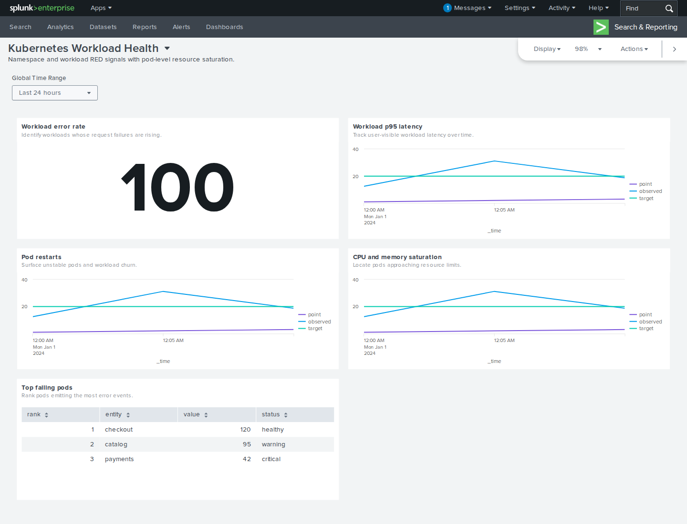
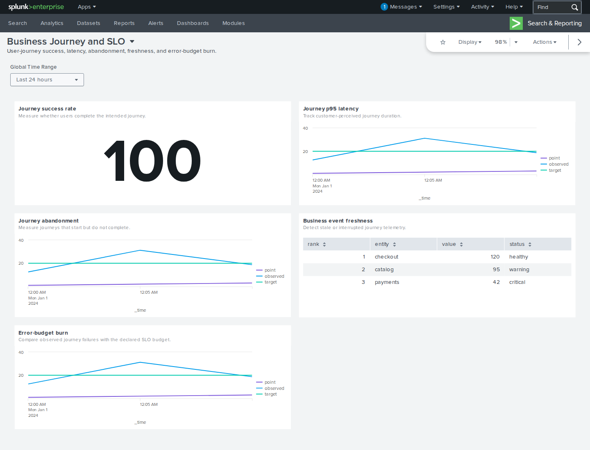
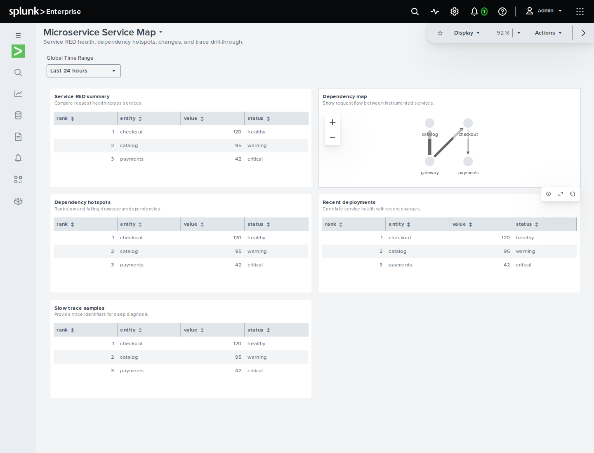
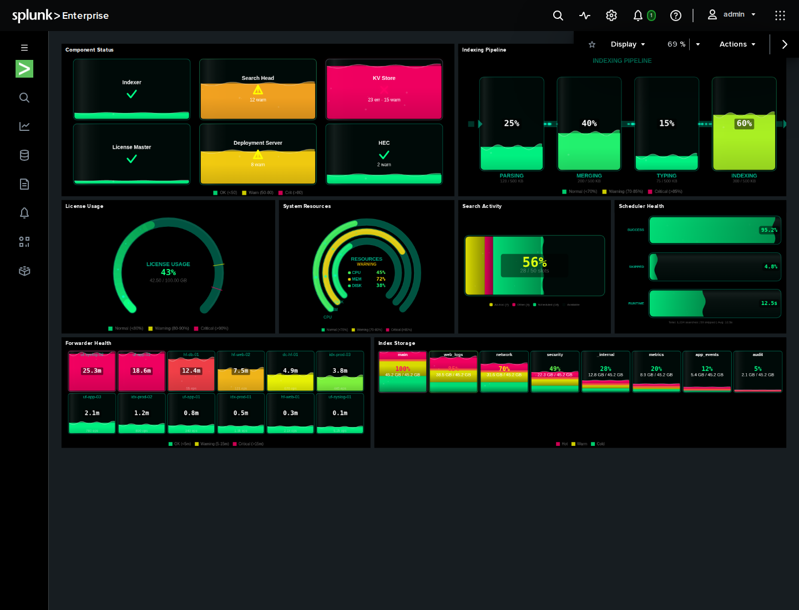

# Dashboard render gallery

These are deterministic Playwright captures from disposable, pinned Splunk Enterprise containers.
They are exact copies of reviewed visual-regression baselines—not mockups—and their source paths,
target versions, byte sizes, and SHA-256 hashes are recorded in
[`images/dashboard-samples/manifest.json`](images/dashboard-samples/manifest.json).

## Splunk Health portable — Enterprise 9.4.3

The app-free compatibility port keeps the eight upstream health searches and dashboard layout,
then renders them with built-in tables and a single value. No custom app is installed on Splunk 9.


## Kubernetes workload health — Enterprise 9.4.3



## Business journey SLO — Enterprise 10.2.0



## Microservice service map — Enterprise 10.4.0



## Splunk Health custom visualizations — Enterprise 10.4.0

This is the provenance-locked source dashboard with the matching `splunk_health` app mounted only
inside the disposable integration fixture.



Regenerate the public copies only after reviewing new baselines:

```console
uv run python scripts/sync_dashboard_samples.py --write
uv run python scripts/sync_dashboard_samples.py --check
```
